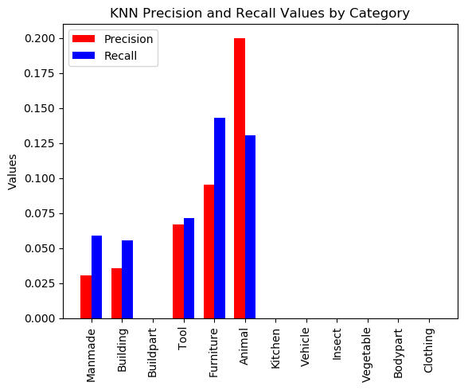
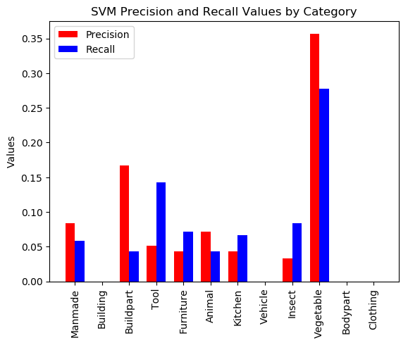
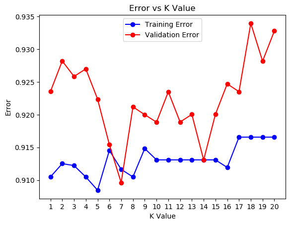

# fmri_natural_language_processing

Based on Predicting Human Brain Activity Associated with the Meanings of Nouns by T. Mitchell

### Introduction
In this analysis, we are taking a look at relationships between images of brain activity captured using FMRI and natural language. This analysis is based off of Predicting Human Brain Activity Associated with the Meanings of Nouns by Tom M. Mitchell in 2008. The goal of this analysis is to train a machine learning algorithm to predict the category of a noun based on the image of brain activity taken when the patient was thinking of said noun. This could give insight into which parts of the brain relate to different concepts.

### The Data
For the experiment, each patient was asked to look at an image representing a noun and think about that noun while an FMRI image was taken of their brain activity. This was done 6 times for each of 60 nouns, each noun from 1 of 12 categories. Our dataset consists of 9 patients with 360 images taken for each patient, for a total of 3240 trials. The image size for each patient varied, from around 19000 voxels (for our purposes, features) to around 21000 voxels. We aimed to train two models to predict the noun category based on the image taken of the patient while they were saying that noun.

### Data Preprocessing
We decided we would train a support vector machine (SVM) and a K-Nearest-Neighbors (KNN) model on our dataset. In order to reduce the training time we decided to take only half of the trials per patient. Specifically we took the first 3/6 images associated with each of the 60 nouns and their concurrent noun categories as labels. Since these models require that all trials must have the same amount of features, and since each patient’s image varied in size, we had to center truncate each image so that they all matched the size of the smallest image, which was 19750 voxels. For our labels, we hard set labels to be 0-11 based on the noun category that the noun belonged to. We also made sure to shuffle our data so that we can have a random mix of patients for each fold of our cross-validation. 

### Cross Validation
For cross-validation, we split the data 80% training and 20% testing. Within the training data we used 5-fold cross-validation on each model. After folding, we applied PCA to reduce the features from 19750 features down to just the 100 features with the highest variance. 

### Training
Since there are more than 2 labels for the dataset, we needed to use a Multi-class classification SVM. After training our SVM classifier on the training set, we tested how good it was on the test set by measuring the precision and recall of the classifier for each word category.

Looking at our bar graph, we can see that the SVM was best at predicting nouns that belonged to the vegetable category while we couldn’t accurately predict anything within the vehicle, bodypart, or clothing categories. 

For our KNN model, we needed to tune the parameter K to find out which value of K would yield the lowest error. We looked at K’s from 1 through 20 and found that K=7 produced the lowest validation error.

Once we knew that 7 was the best value for K, we retrained the KNN classifier with a K value of 7 on the training/validation set. Just like the SVM classifier, we measured the precision and recall of the classifier on the test set for each word category.

For our final results, we found that our SVM model had an accuracy of 0.060185 and our KNN model had an accuracy of 0.037037. Our models were not very good at predicting the labels based on the images. 
